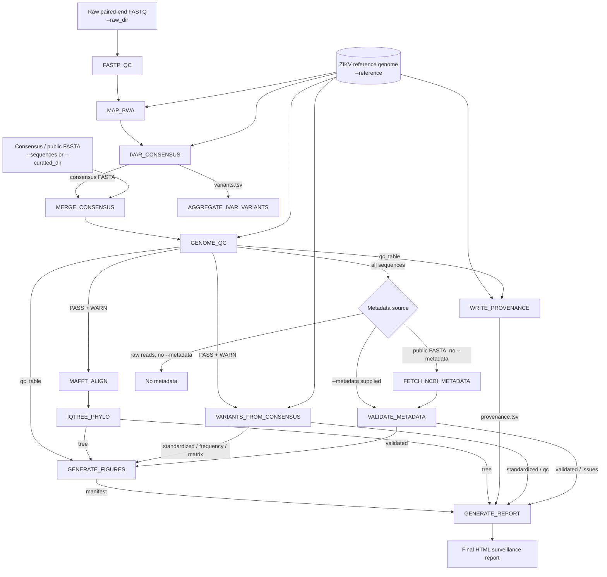

# Zika-Sentinel

[](https://www.nextflow.io/)
[](https://hub.docker.com/r/kizitodevbio/zika-sentinel)
[](LICENSE)

**Zika-Sentinel** is a modular Nextflow DSL2 workflow for genomic surveillance of **Zika virus (ZIKV)**. It accepts either raw paired-end Illumina FASTQ reads or pre-assembled/public consensus FASTA sequences, and carries both pathways through a shared genome-QC → alignment → phylogeny → variant → reporting pipeline, producing a provenance-tracked HTML surveillance report.

---

## Overview

Zika virus genomic surveillance supports outbreak response, lineage tracking, and molecular epidemiology by turning raw sequencing data or public genome collections into comparable, quality-controlled results. Zika-Sentinel brings together:

- read trimming and mapping to a ZIKV reference genome
- consensus genome generation and read-backed variant calling (raw-read pathway)
- direct ingestion of pre-assembled or public consensus FASTA (curated pathway)
- genome quality control against configurable length/ambiguity thresholds
- multiple sequence alignment and maximum-likelihood phylogenetic inference
- consensus-vs-reference SNP identification
- automatic NCBI metadata retrieval for public sequences (or user-supplied metadata)
- integrated figures, run provenance, and a final HTML report

The pipeline enforces a small set of scientific guardrails: it does not treat dataset-level variant frequency as population prevalence, does not treat phylogenetic clustering as confirmed transmission, does not invent genotype/lineage labels or metadata, and reports failed genomes with PASS/WARN/FAIL status rather than silently dropping them. Sample identifiers from the input dataset are preserved end-to-end; the pipeline name is never used as a sample label.

### What the workflow does

| Stage                        | Implementation                                             |
| ----------------------------- | ----------------------------------------------------------- |
| Read QC / trimming             | `FASTP_QC` (fastp)                                          |
| Read mapping                   | `MAP_BWA` (BWA-MEM against the ZIKV reference)               |
| Consensus + read-backed variants | `IVAR_CONSENSUS` (iVar)                                     |
| Sequence merging                | `MERGE_CONSENSUS`                                            |
| Genome QC                       | `GENOME_QC` (length-fraction and N-fraction thresholds)      |
| Multiple sequence alignment     | `MAFFT_ALIGN` (MAFFT)                                        |
| Phylogenetic inference          | `IQTREE_PHYLO` (IQ-TREE 2)                                    |
| Public-sequence metadata        | `FETCH_NCBI_METADATA` + `VALIDATE_METADATA`                   |
| Consensus-vs-reference variants | `VARIANTS_FROM_CONSENSUS`                                     |
| Read-backed variant aggregation | `AGGREGATE_IVAR_VARIANTS`                                     |
| Figures                         | `GENERATE_FIGURES`                                            |
| Run provenance                  | `WRITE_PROVENANCE`                                            |
| Final report                    | `GENERATE_REPORT`                                              |

---

## Workflow



### Input pathways

Exactly one input pathway must be supplied.

**Raw-read pathway** (`--raw_dir`)

1. Paired-end FASTQ discovery across common Illumina naming conventions
2. Quality control and trimming (`FASTP_QC`)
3. Reference mapping (`MAP_BWA`)
4. Consensus generation and read-backed variant calling (`IVAR_CONSENSUS`)
5. Read-backed variants are aggregated separately (`AGGREGATE_IVAR_VARIANTS`) and are **not** substituted into the consensus-vs-reference variant analysis
6. Consensus FASTA enters the shared downstream pathway

This pathway (FASTP → BWA → iVar) has been run end-to-end against real ZIKV FASTQ data (`real_data/raw_read_validation/zika_high_quality_5`).

**Consensus / public FASTA pathway** (`--sequences`, alias `--curated_dir`)

1. FASTA files are read directly from a multi-FASTA file or a directory of `.fa` / `.fna` / `.fasta` files
2. Sequences are merged and pass directly into genome QC (no read QC/assembly stage)
3. If no `--metadata` is supplied, sample identifiers are used to automatically retrieve metadata from NCBI

### Shared downstream pathway

Both pathways converge at `MERGE_CONSENSUS`, after which:

- `GENOME_QC` classifies every sequence as PASS / WARN / FAIL against `--qc_min_length_frac`, `--qc_warn_n_frac`, and `--qc_max_n_frac`
- Only PASS and WARN sequences proceed to `MAFFT_ALIGN` and `VARIANTS_FROM_CONSENSUS`
- `IQTREE_PHYLO` infers a maximum-likelihood tree from the MAFFT alignment
- `VARIANTS_FROM_CONSENSUS` computes consensus-vs-reference SNPs — a source explicitly kept separate from the read-backed iVar variants, since consensus-derived variants have no associated depth, allele frequency, or base quality
- Metadata resolution priority: user-supplied `--metadata` > automatic NCBI retrieval (public-FASTA pathway only) > no metadata (raw-read pathway without `--metadata`)
- `GENERATE_FIGURES`, `WRITE_PROVENANCE`, and `GENERATE_REPORT` combine the QC table, tree, variant tables, and metadata into the final output set

---

## Supported inputs

### Raw paired-end reads

FASTQ files are discovered by pattern matching against `<sample>_1`/`<sample>_2` or `<sample>_R1`/`<sample>_R2`, with `.fastq` or `.fq`, gzipped or not:

```
sample_1.fastq / sample_2.fastq
sample_1.fastq.gz / sample_2.fastq.gz
sample_R1.fastq / sample_R2.fastq
sample_R1.fastq.gz / sample_R2.fastq.gz
sample_1.fq / sample_2.fq
sample_1.fq.gz / sample_2.fq.gz
sample_R1.fq / sample_R2.fq
sample_R1.fq.gz / sample_R2.fq.gz
```

The pipeline validates that every detected sample has exactly one R1 and one R2 file before building the FASTQ channel, and fails with a descriptive error on duplicate or incomplete pairs.

### Consensus / public genomes

```text
zika_sequences/
├── ZIKV_sample_01.fasta
├── ZIKV_sample_02.fna
└── ZIKV_sample_03.fa
```

Supported extensions: `.fa`, `.fna`, `.fasta`. A single multi-FASTA file may also be passed directly to `--sequences`.

### Optional metadata

`--metadata` accepts a TSV/CSV with `sample_id` as the primary key, matching sequence identifiers. If omitted for the public-FASTA pathway, metadata is retrieved automatically from NCBI using the sequence accessions preserved by `GENOME_QC`.

---

## Verified run (100 curated public ZIKV genomes)

The repository includes a larger validation run (`results_curated_100_v1`) of 100 curated/public ZIKV consensus genomes — NCBI accessions spanning `KJ776791.2` through `PV549935.1`, collected between 2012 and 2025 across multiple countries — pushed through the consensus/public-FASTA pathway against the bundled reference `assets/reference/ZIKV_NC_012532.1.fasta` (NC_012532.1, 10,794 bp):

| Stage                        | Result                                                                                                                                                   |
| ----------------------------- | ------------------------------------------------------------------------------------------------------------------------------------------------------- |
| Genome QC                     | 100/100 PASS, 0 WARN, 0 FAIL (`--qc_min_length_frac 0.70`); sequence lengths ranged 10,272–11,155 bp                                                     |
| Metadata                      | Retrieved and validated from NCBI for all 100 accessions (collection date, country, location, host, source)                                              |
| Consensus-vs-reference SNPs   | 117,182 SNP observations across 100 samples; 2,752 unique variant positions; per-sample SNP counts ranged 758–1,429 (ambiguous bases skipped, indels excluded from the SNP matrix, depth/allele-frequency left empty — these are consensus-vs-reference calls, not read-backed) |
| MAFFT alignment               | 100 sequences aligned (208 ambiguous characters flagged in the alignment log)                                                                             |
| IQ-TREE                       | Best-fit model (BIC): TIM2+F+I+G4; 8,560 constant sites (76.6% of alignment); proportion of invariable sites 0.4259; total tree length 0.4830; ultrafast bootstrap; valid Newick tree written to `zika_phylogeny.nwk` |
| Figures                       | 11 figures generated under `figures/` (sequence length, N-fraction, QC status, geographic/temporal distribution, variants-per-sample, variant position distribution, top variant frequency, SNP presence heatmap, pairwise SNP distance, variants by country), each with a CSV in `figures/source_data/`, tracked in `figure_manifest.tsv` |
| Provenance + report            | `provenance.tsv` / `provenance.json` and a final `zika_report.html` + `zika_summary.csv`, generated from the tables above                                 |

This run exercises the full consensus/public-FASTA pathway end-to-end at a meaningfully larger scale. The raw-read pathway (FASTP → BWA-MEM → iVar) has also been run end-to-end against real ZIKV FASTQ data (`real_data/raw_read_validation/zika_high_quality_5`).

---

## Quick start

### Prerequisites

- [Nextflow](https://www.nextflow.io/) ≥ 23 (tested with 26.04.6)
- Docker (recommended), **or** local installs of: fastp, bwa, minimap2, samtools, bcftools, bedtools, iVar, MAFFT, IQ-TREE 2, and Python 3 with Biopython/pandas/matplotlib/pysam

### Clone the repository

```bash
git clone https://github.com/kizito-devbio/Zika-Sentinel.git
cd Zika-Sentinel
```

### Pull the runtime image

Nextflow itself runs on the host; the [`kizitodevbio/zika-sentinel`](https://hub.docker.com/r/kizitodevbio/zika-sentinel) image supplies the per-process tool environment that `-profile docker` calls into.

```bash
docker pull kizitodevbio/zika-sentinel:1.1.0
```

### Run with public / consensus FASTA (Docker)

```bash
nextflow run pipeline.nf -profile docker \
  --curated_dir test_data/zika_public.fasta \
  --outdir results_public
```

`test_data/zika_public.fasta` is just the bundled example file used above — replace it with the path to your own FASTA file or directory of FASTA files. `--curated_dir` is an accepted alias for `--sequences` if you prefer that name.

### Run with public / consensus FASTA (local tools, no Docker)

```bash
nextflow run pipeline.nf -profile local \
  --curated_dir test_data/zika_public.fasta \
  --outdir results_public \
  --max_cpus 2 --max_memory '4 GB'
```

### Run with raw paired-end reads (Docker)

```bash
nextflow run pipeline.nf \
  -profile docker \
  --raw_dir real_data/raw_read_validation/zika_high_quality_5 \
  --outdir results_raw_high_quality_final \
  --max_cpus 8 \
  --max_memory '16 GB'
```

`real_data/raw_read_validation/zika_high_quality_5` is the path used for this pipeline's own raw-read validation run — point `--raw_dir` at wherever your own paired-end FASTQ files live instead. In both pathways above, whatever you pass after `--raw_dir` or `--sequences`/`--curated_dir` is a filesystem path — either relative to the directory you run `nextflow run` from, or an absolute path — not a fixed value the pipeline expects.

Neither example above passes `--reference`: `nextflow.config` defaults it to the bundled `assets/reference/ZIKV_NC_012532.1.fasta` (NC_012532.1), so it's picked up automatically for both pathways unless you explicitly point `--reference` at a different genome. Likewise, `--max_cpus` and `--max_memory` are just ceilings — scale them down (e.g. `--max_cpus 2 --max_memory '4 GB'`) to match a laptop rather than a workstation.

### Resume an interrupted run

```bash
nextflow run pipeline.nf -profile docker \
  --curated_dir test_data/zika_public.fasta \
  --outdir results_public \
  -resume
```

```bash
nextflow run pipeline.nf \
  -profile docker \
  --raw_dir real_data/raw_read_validation/zika_high_quality_5 \
  --outdir results_raw_high_quality_final \
  --max_cpus 8 \
  --max_memory '16 GB'
  --resume
```

### Help

```bash
nextflow run pipeline.nf --help
```

---

## Configuration and parameters

Parameters and defaults, as declared in `nextflow.config`:

| Parameter               | Default                                              | Purpose                                                        |
| ------------------------ | ----------------------------------------------------- | ---------------------------------------------------------------- |
| `--raw_dir`              | `false`                                               | Directory of paired-end FASTQ files                             |
| `--sequences`            | `false`                                               | Consensus / public FASTA file or directory                      |
| `--curated_dir`          | `false`                                               | Alias for `--sequences`                                          |
| `--metadata`             | `false`                                               | Sample metadata TSV/CSV (`sample_id` primary key)                |
| `--outdir`               | `./results`                                           | Output directory                                                 |
| `--reference`            | `assets/reference/ZIKV_NC_012532.1.fasta`             | ZIKV reference genome (NC_012532.1, Asian lineage, 10,794 bp)      |
| `--primer_bed`           | `false`                                               | Primer BED file (amplicon datasets only)                          |
| `--min_depth`            | `10`                                                  | Minimum depth for consensus calling                               |
| `--min_freq`             | `0.5`                                                 | Majority allele frequency threshold                                |
| `--min_qual`             | `20`                                                  | Minimum base quality                                               |
| `--mask_depth`           | `10`                                                  | Depth threshold below which positions are masked                  |
| `--qc_min_length_frac`   | `0.70`                                                | Minimum genome length as a fraction of the reference               |
| `--qc_max_n_frac`        | `0.30`                                                | N-fraction above which a genome FAILs QC                          |
| `--qc_warn_n_frac`       | `0.10`                                                | N-fraction above which a genome WARNs (but still proceeds)         |
| `--mafft_opts`           | `--auto`                                              | Options passed to MAFFT                                           |
| `--iqtree_model`         | `MFP`                                                 | IQ-TREE model selection mode                                       |
| `--iqtree_bootstrap`     | `1000`                                                | Bootstrap replicates for IQ-TREE                                   |
| `--run_nextclade`        | `false`                                               | Nextclade stage (disabled until ZIKV dataset support is confirmed) |
| `--nextclade_dataset`    | `"zika"`                                              | Nextclade dataset name, if enabled                                  |
| `--max_cpus`             | `8`                                                   | CPU ceiling for `high_compute`-labelled processes                  |
| `--max_memory`           | `2 GB`                                                | Memory ceiling for `high_compute`-labelled processes                |
| `--pipeline_version`     | `1.1.0`                                               | Pipeline version string used in logs and the Docker tag             |
| `--help`                 | `false`                                               | Print help and exit                                                |

Exactly one of `--raw_dir` or `--sequences`/`--curated_dir` must be supplied; supplying both or neither causes the pipeline to fail fast with an explanatory error, as does a missing `--reference` file.

### Process resource labels

Processes are grouped under three resource labels in `nextflow.config`: `low_compute` (2 CPU / 1 GB), `med_compute` (4 CPU / 1 GB), and `high_compute` (scaled to `--max_cpus` / `--max_memory`). `process.errorStrategy` is set to `terminate`.

### Profiles

| Profile       | Description                                                                 |
| ------------- | ----------------------------------------------------------------------------- |
| `docker`      | Runs processes in `kizitodevbio/zika-sentinel:1.1.0`, non-root user           |
| `singularity` | Same container image, run via Singularity/Apptainer                          |
| `conda`       | Enables Conda environments where defined                                      |
| `cluster`     | SLURM executor, `normal` queue (combine with `docker` or `singularity`)       |
| `test`        | Lightweight settings: `max_cpus=2`, `max_memory='1 GB'`, `iqtree_bootstrap=100` |
| `local`       | Local executor with Docker/Singularity explicitly disabled                     |

### Execution reports

`nextflow.config` enables Nextflow's built-in `timeline`, `report`, `trace`, and `dag` outputs, written under `${outdir}/logs/`.

---

## Pipeline modules

Module paths and the processes they export, as wired together in `pipeline.nf`:

| Module                                      | Process(es)                                        |
| --------------------------------------------- | ----------------------------------------------------- |
| `modules/qc.nf`                               | `FASTP_QC`                                            |
| `modules/mapping/map_bwa.nf`                  | `MAP_BWA`                                             |
| `modules/consensus/ivar_consensus.nf`         | `IVAR_CONSENSUS`                                      |
| `modules/merge/merge_consensus.nf`            | `MERGE_CONSENSUS`                                     |
| `modules/genome_qc/genome_qc.nf`              | `GENOME_QC`                                           |
| `modules/align/mafft.nf`                      | `MAFFT_ALIGN`                                         |
| `modules/phylogeny/iqtree.nf`                 | `IQTREE_PHYLO`                                        |
| `modules/metadata/fetch_ncbi_metadata.nf`     | `FETCH_NCBI_METADATA`                                 |
| `modules/metadata/validate_metadata.nf`       | `VALIDATE_METADATA`                                   |
| `modules/variants/aggregate_variants.nf`      | `AGGREGATE_IVAR_VARIANTS`, `VARIANTS_FROM_CONSENSUS`  |
| `modules/visualization/generate_figures.nf`   | `GENERATE_FIGURES`                                    |
| `modules/reporting/provenance.nf`             | `WRITE_PROVENANCE`                                    |
| `modules/reporting/report.nf`                 | `GENERATE_REPORT`                                     |

---

## Docker image

Zika-Sentinel's runtime environment is published as [`kizitodevbio/zika-sentinel`](https://hub.docker.com/r/kizitodevbio/zika-sentinel) on Docker Hub, built from `docker/Dockerfile` in this repository. It provides the per-process tool environment that Nextflow calls into via `-profile docker` / `-profile singularity`; Nextflow itself is not bundled and is expected to run on the host.

| Property     | Value                                                          |
| ------------- | ----------------------------------------------------------------- |
| Base image    | Ubuntu 22.04                                                    |
| Current tag   | `1.1.0`                                                          |
| Architecture  | `linux/amd64` (tested on Linux, WSL2, Docker Desktop for Windows/macOS; arm64/Apple Silicon not yet validated) |
| Image size    | ~438 MB                                                          |
| Workdir       | `/workspace` (recommended bind-mount point for input/output data) |

### Bundled tools

| Stage                          | Tools                                                                                              |
| -------------------------------- | ------------------------------------------------------------------------------------------------------ |
| QC & trimming                    | fastp, FastQC                                                                                        |
| Read mapping                     | bwa, minimap2, samtools, bcftools, bedtools                                                          |
| Consensus / variant calling       | iVar 1.4.2 (compiled from the [andersen-lab/ivar](https://github.com/andersen-lab/ivar) `v1.4.2` release) |
| Multiple sequence alignment       | MAFFT 7.505 (compiled from the official MAFFT source release)                                        |
| Phylogenetics                     | IQ-TREE 2.0.7+dfsg-1 (apt-pinned)                                                                     |
| Reporting / DAG rendering          | Graphviz                                                                                              |
| Scientific Python (`/opt/venv`)   | pandas 2.2.2, numpy 1.26.4, matplotlib 3.8.4, seaborn 0.13.2, biopython 1.83, requests 2.32.3, pysam 0.22.1 |
| Metadata retrieval                 | `bin/fetch_ncbi_metadata.py` — normalizes NCBI metadata for the public/curated FASTA pathway            |

A full record of installed tool versions is written at build time to `/opt/zika-sentinel-tool-versions.txt` inside the image, so a failed version check surfaces at build time rather than at runtime.

### Design notes

- **MAFFT is compiled from source**, not installed via `apt` — Ubuntu 22.04's repositories don't ship the required 7.505 version.
- **iVar is compiled from the tagged `v1.4.2` GitHub release** (`autogen.sh` → `configure` → `make` → `make install`) rather than taken from a package manager.
- **IQ-TREE is pinned to `2.0.7+dfsg-1`** via `apt`, rather than left to float with the distribution default, to keep phylogenetic runs reproducible across rebuilds.
- **Python dependencies are isolated** in a venv at `/opt/venv` with explicit version pins, separate from system Python.
- The image is **reference-guided-viral-surveillance scoped only**: it deliberately excludes de novo assembly (no SPAdes/Unicycler), annotation (no Prokka), AMR/virulence screening (no Abricate), and bacterial typing/pangenome tools (no MLST, Kaptive, Roary, Panaroo) — those live in the companion [Strepto-Pipeline](https://hub.docker.com/r/kizitodevbio/strepto-pipeline) image used by GBS-Sentinel.

### Interactive use / sanity check

```bash
docker run -it --rm \
  -v /path/to/your/data:/workspace \
  kizitodevbio/zika-sentinel:1.1.0 \
  /bin/bash
```

```bash
fastp --version
bwa
minimap2 --version
ivar version
mafft --version
iqtree2 --version || iqtree --version
python3 -c "import Bio, pandas, pysam; print('OK')"
```

### Build it yourself

```bash
git clone https://github.com/kizito-devbio/Zika-Sentinel.git
cd Zika-Sentinel/docker
docker build -t zika-sentinel:local .
```

Expect the build to take a few extra minutes over a pure `apt`-based image, since MAFFT and iVar are compiled from source.

### Tags & versioning

| Tag      | Notes                                    |
| --------- | ------------------------------------------ |
| `1.1.0`   | Current release, matches `pipeline_version` in `nextflow.config` |

Pin a specific tag in production/CI rather than relying on `latest`; see the [Tags page on Docker Hub](https://hub.docker.com/r/kizitodevbio/zika-sentinel/tags) for the full history and image digests.

---

## Repository layout

```text
pipeline.nf
nextflow.config
docker/Dockerfile
modules/          # qc, mapping, consensus, merge, genome_qc, align, phylogeny,
                   # variants, metadata, visualization, reporting
bin/               # download_zika_sequences.py, generate_report.py
assets/reference/  # ZIKV_NC_012532.1.fasta
assets/schemas/    # metadata_schema.md
test_data/         # public genomes, metadata, stage-verification artefacts
```

---

## Known limitations

- Genome QC, alignment, and phylogeny quality depend on the completeness of the input consensus sequence relative to the reference
- Automatic NCBI metadata retrieval requires that sequence identifiers correspond to valid NCBI accessions; FASTQ sample names are not assumed to be NCBI accessions, so raw-read runs without `--metadata` proceed without sample metadata

---

## Acknowledgements

Zika-Sentinel was developed with project supervision from **Dr Edyth Parker**, and MSc supervision from **Prof. Aemere Ogunlaja**. The work was supported by a research grant from the **Health Research Grant Initiative (HRGI)**.

---

## License

MIT License — see [LICENSE](LICENSE).

## Contributing

See [CONTRIBUTING.md](CONTRIBUTING.md) and [CODE_OF_CONDUCT.md](CODE_OF_CONDUCT.md).

## Maintainer

**Kizito Ibeojo Sylvester-Ali**
MSc Molecular Biology & Genomics, Redeemer's University

- Email: kizitosylvesterali@gmail.com
- GitHub: https://github.com/kizito-devbio
- Docker Hub: https://hub.docker.com/u/kizitodevbio

For questions, bug reports, feature requests, or collaboration, please open a [GitHub issue](https://github.com/kizito-devbio/Zika-Sentinel/issues) or reach out by email.

## Links

- **Zika-Sentinel (pipeline)**: https://github.com/kizito-devbio/Zika-Sentinel
- **Zika-Sentinel (Docker image)**: https://hub.docker.com/r/kizitodevbio/zika-sentinel
- **Architectural predecessor**: https://github.com/kizito-devbio/GBS-Sentinel
- **Nextflow**: https://www.nextflow.io/

---

*Zika-Sentinel — genomic surveillance for Zika virus (ZIKV)*
